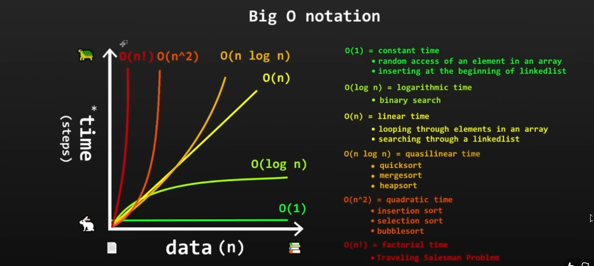

# Outputs of all the practice codes:
## 1. StackPractice.java:
```java
Is stack empty?: true
Is stack empty?: false
My favourite game is GTA SA
My 2nd favourite game is GTA VC
GTA VC is at index 1
Stack values are: [GTA 1, GTA 2, GTA 3, GTA VC]
```
---
## 2. QueuePractive.java:
```java
Is queue empty?: true
Is queue empty?: false
Size of the queue is 4
is Harold in queue?: true
what is the index of Harold in queue?: 3
The person first in the line is Karen
The person first in the line is Steve
Queue values are: [Steve, Harold]
```
---
## 3. PriorityQueuePractice.java:
```java
Is queue empty?: true
Is queue empty?: false
Size of the queue is 5
is F in queue?: true
what is the index of F in queue?: 0
The person first in the line is F
The person first in the line is C
Queue values are: [C, B, A]
C
B
A
```
---
## 4. LinkedListPractice.java:
```java
[F, E, D, C, B, A]
[D, C, B, A]
2
D
A
[E, D, C, B, A, 0]
[D, C, B, A]
```
---
## 5. DynamicArrayPractice.java:
```java
0
[C, D, E]
Empty: false
Size: 3
Capacity: 5
```
---
## 6. LinkedlisVSArraylist.java:
```java
LinkedList: 18447ns
ArrayList: 9422ns
```
---
## 7. BigONotation.java:

```java
Linear: 8254753ns
Constant: 3134ns
```
---
## 8. LinearSearch.java:
```java
Element found at index: 8
```
---
## 9. Binarysearch.java:
```java
Middle: 499999
Middle: 749999
Middle: 874999
Middle: 812499
Middle: 781249
Middle: 765624
Middle: 773436
Middle: 777342
Middle: 779295
Middle: 778318
Middle: 777830
Middle: 777586
Middle: 777708
Middle: 777769
Middle: 777799
Middle: 777784
Middle: 777776
Middle: 777780
Middle: 777778
Middle: 777777
Target found at index: 777777
```
---
## 10. InterpolationSearch.java:
```java
Probe: 4
Probe: 6
Probe: 7
Probe: 8
Element found at index: 8
```